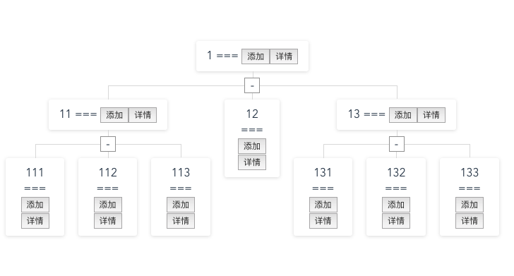
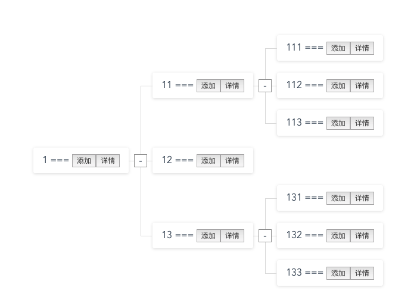

# 拓展支持自定义节点样式 和 自定义折叠图标

[](https://www.npmjs.com/package/vue-org-tree2)
## Install

```
$ npm i vue-org-tree2 -S
```

### Register
- global register
```
import Vue from 'vue'
import VueOrgTree from 'vue-org-tree2'
Vue.use(VueOrgTree)
```
component register
 ```
import VueOrgTree from 'vue-org-tree2'
export default {
  components: {
    [VueOrgTree.name]: VueOrgTree
  }
}
```

> 依赖 `sass[scss]` support

if your project can't support scss please add below dependence
```
npm install node-sass --save-dev
npm install sass-loader --save-dev
```

> 如需更改边线宽高 请覆盖以下变量， 默认值如下：
```
$_vue-org-tree2_line-width: 50px !default;
$_vue-org-tree2_line-height: 50px !default;
```

## API

  * #### props


	prop           | descripton                   | type                   | default
	---------------|------------------------------|:----------------------:|---------------------
	data           |                              | `Object`               |
	labelKey       | label的key                   | `String`               | `label`
	childrenKey    | children的key                | `String`               | `children`
	expandKey      | 展开状态标识的key              | `String`               | `expand`
	horizontal     | 水平展示                      | `Boolean`              |  false
	collapsable    | 是否支持展开                   | `Boolean`              |  false


## Base Usage

```
<vue-org-tree :data="data" collapsable>
  <template slot-scope="{item}">
    {{item.label}} === <button>添加</button><button>详情</button>
  </template>
  <div slot="expandBtn" slot-scope="{isExpanded}">
    <div v-if="isExpanded" style="border: 1px solid #9b9b9b; background: #fff;width: 20px; height: 20px; display: flex; align-items: center; justify-content: center">-</div>
    <div v-else style="border: 1px solid #9b9b9b; background: #fff; width: 20px; height: 20px; display: flex; align-items: center; justify-content: center"> + </div>
  </div>
</vue2-org-tree>
```

[demo code](./src/components/HelloWorld.vue)

## 效果



